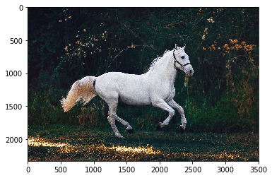
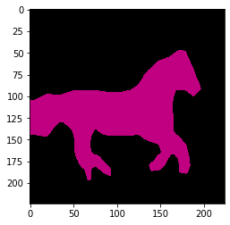
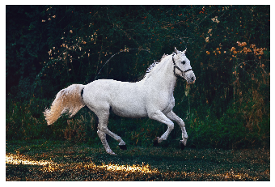

### 什么是语义分割？
语义分割是图像分析任务中的一种，将图像每个像素分为特定的类别。其实这就是我们人眼在看东西时默认的操作，我们看一张图像的时候，我们清楚的知道每个像素属于哪个类别。这个过程我们也可以利用计算机视觉的技术去实现。
目前已经有很多语义分割的的研究，具体的可以看这篇博客： https://www.learnopencv.com/image-segmentation/

下面，我们看一个例子：

<small> Source: Pexels </small>

上面这张图像的语义分割结果是：

可以看到，图像中的每个像素都分类到特定的类别。


### 语义分割的应用
语义分割常用的领域有以下几项：
#### 1. 自动驾驶
   <br/>
  <small> Source: CityScapes Dataset </small>
  在自动驾驶中，算法对相机拍摄的实时图像进行语义分割，当中的每个像素都被分为特定的类别，这可以帮助计算机理解当前的场景内容，辅助计算机作出驾驶决策。
#### 2. 脸部分割
    <br/>
  <small> Source: https://github.com/massimomauro/FASSEG-repository/blob/master/papers/multiclass_face_segmentation_ICIP2015.pdf </small>
  脸部分割旨在将脸部的五官分割开，这是非常有商业价值的工作。可以进行自动上妆，口红试色，表情分析，性格和性别估计。
#### 3. 室内场景分割
  <br/>
  <small> Source: http://buildingparser.stanford.edu/dataset.html </small>
  在AR或者VR场景中经常会用到这类。
#### 4. 遥感学
  <br/>
  <small> Source: https://www.sciencedirect.com/science/article/pii/S0924271616305305 </small>
  地理陆地感测是将卫星图像中的每个像素分类为一个类别，这样我们就可以跟踪每个区域的土地覆盖。所以说，在一些地区发生了严重的森林砍伐，然后采取适当的措施。

### 使用torchvision来进行语义分割
在开始之前，我们需要理解语义分割任务的输入和输出。
一个语义分割模型的输入是一个三通道的已经归一化和标准化的图像，比如使用mean = [0.485, 0.456, 0.406], std = [0.229, 0.224, 0.225]
所以，输入是一个[Ni x Ci x Hi x Wi]形状的张量
- Ni是batchsize
- Ci是通道数(3)
- Hi是图像的高度
- Wi是图像的宽度  

模型的输出是[No x Co x Ho x Wo]形状的张量
- No和Ni相等是batchsize
- Co是数据集中所有的类别
- Ho是图像的高度
- Wo是图像的宽度

最后，需要注意的是torchvision中模型的输出是一个OrderedDict而不是一个torch.Tensor。并且在eval模式下，输出是一个只有一个键值out的Dict，所以，out这个key对应的张量就是[No x Co x Ho x Wo]


```python
from torchvision import models
fcn = models.segmentation.fcn_resnet101(pretrained=True).eval()
```

    Downloading: "https://download.pytorch.org/models/fcn_resnet101_coco-7ecb50ca.pth" to /home/tangxi.zq/.cache/torch/checkpoints/fcn_resnet101_coco-7ecb50ca.pth
    100%|██████████| 208M/208M [00:13<00:00, 16.0MB/s] 


```python
from PIL import Image
import matplotlib.pyplot as plt
import torch
!wget https://images.pexels.com/photos/1996333/pexels-photo-1996333.jpeg
```

    --2019-10-09 10:11:26--  https://images.pexels.com/photos/1996333/pexels-photo-1996333.jpeg
    Resolving images.pexels.com (images.pexels.com)... 104.17.208.102, 104.17.209.102, 2606:4700::6811:d066, ...
    Connecting to images.pexels.com (images.pexels.com)|104.17.208.102|:443... connected.
    HTTP request sent, awaiting response... 200 OK
    Length: 6604923 (6.3M) [image/jpeg]
    Saving to: ‘pexels-photo-1996333.jpeg’
    
    100%[======================================>] 6,604,923   4.27MB/s   in 1.5s   
    
    2019-10-09 10:11:29 (4.27 MB/s) - ‘pexels-photo-1996333.jpeg’ saved [6604923/6604923]
    


```python
img = Image.open("pexels-photo-1996333.jpeg")
plt.imshow(img);plt.show()
```





 现在，我们对这个图像进行预处理，具体步骤如下：
 
- 将图像resize成(256x256)
- crop成(224x224)
- 转为Tensor，从[0,255]转为[0,1]
- 标准化和归一化，mean = [0.485, 0.456, 0.406], std = [0.229, 0.224, 0.225]
最后，我们对其进行升维操作，使其从[C x H x W]变为[1 x C x H x W]


```python
import torchvision.transforms as T
trf = T.Compose([T.Resize(256),
                 T.CenterCrop(224),
                 T.ToTensor(), 
                 T.Normalize(mean = [0.485, 0.456, 0.406], 
                             std = [0.229, 0.224, 0.225])])
inp = trf(img).unsqueeze(0)
```

由于网络的输出是一个OrderedDict，所以，我们需要拿出out这个key对应的输出


```python
out = fcn(inp)['out']
print (out.shape)
```

    torch.Size([1, 21, 224, 224])


好吧！所以，out是模型的最终输出。正如我们所看到的，它的形状是[1 x 21 x h x w]，如前所述。因此，模型被训练在21个类上，因此我们的输出有21个通道！
现在，我们需要做的是将这个21通道输出转换成2D图像或1通道图像，其中图像的每个像素对应于一个类！
因此，2D图像（形状[H xW]）将具有对应于类标签的每个像素，从而

对于这个2d图像中的每一个（x，y），将对应一个0-20之间的数字，表示一个类。

我们能从这个[1 x 21 x H x w]的输出张量得到什么？

我们在每个像素位置取其21个值中的最大值，它表示该像素归属的类


```python
import numpy as np
om = torch.argmax(out.squeeze(),dim=0).detach().cpu().numpy()
print(om.shape)
print(np.unique(om))
```

    (224, 224)
    [ 0 13]


```python
def decode_segmap(image, nc=21):
  
    label_colors = np.array([(0, 0, 0),  # 0=background
               # 1=aeroplane, 2=bicycle, 3=bird, 4=boat, 5=bottle
               (128, 0, 0), (0, 128, 0), (128, 128, 0), (0, 0, 128), (128, 0, 128),
               # 6=bus, 7=car, 8=cat, 9=chair, 10=cow
               (0, 128, 128), (128, 128, 128), (64, 0, 0), (192, 0, 0), (64, 128, 0),
               # 11=dining table, 12=dog, 13=horse, 14=motorbike, 15=person
               (192, 128, 0), (64, 0, 128), (192, 0, 128), (64, 128, 128), (192, 128, 128),
               # 16=potted plant, 17=sheep, 18=sofa, 19=train, 20=tv/monitor
               (0, 64, 0), (128, 64, 0), (0, 192, 0), (128, 192, 0), (0, 64, 128)])

    r = np.zeros_like(image).astype(np.uint8)
    g = np.zeros_like(image).astype(np.uint8)
    b = np.zeros_like(image).astype(np.uint8)
  
    for l in range(0, nc):
        idx = image == l
        r[idx] = label_colors[l, 0]
        g[idx] = label_colors[l, 1]
        b[idx] = label_colors[l, 2]
    
    rgb = np.stack([r, g, b], axis=2)
    return rgb
```


```python
rgb = decode_segmap(om)
plt.imshow(rgb); plt.show()
```





```python
def segment(net, path, show_orig=True):
    img = Image.open(path)
    if show_orig: plt.imshow(img); plt.axis('off'); plt.show()
    # Comment the Resize and CenterCrop for better inference results
    trf = T.Compose([T.Resize(640), 
                   #T.CenterCrop(224), 
                   T.ToTensor(), 
                   T.Normalize(mean = [0.485, 0.456, 0.406], 
                               std = [0.229, 0.224, 0.225])])
    inp = trf(img).unsqueeze(0)
    out = net(inp)['out']
    om = torch.argmax(out.squeeze(), dim=0).detach().cpu().numpy()
    rgb = decode_segmap(om)
    plt.imshow(rgb); plt.axis('off'); plt.show()
```


```python
segment(fcn,"pexels-photo-1996333.jpeg")
```





```python

```
